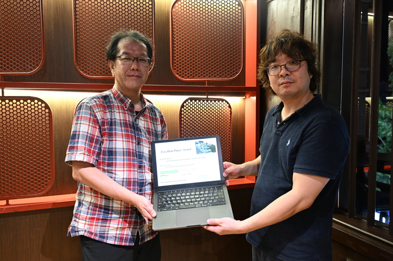

2026年08月25日〜08月28日にDa Nang, Vietnamで開催された[20th International Workshop on Informatics (IWIN2026)](https://www.infsoc.org/conference/iwin2026/)における稲村教授らの論文が、[Excellent Paper Award](https://www.infsoc.org/conference/iwin2026/award)を受賞しました！
おめでとうございます！

## 論文情報

- T. Kodama, H. Inamura, and S. Ishida, “Low-rate DoS Attack Mitigation Using PEP,” International Workshop on Informatics (IWIN), Da Nang, Vietnam, Aug 2026.

